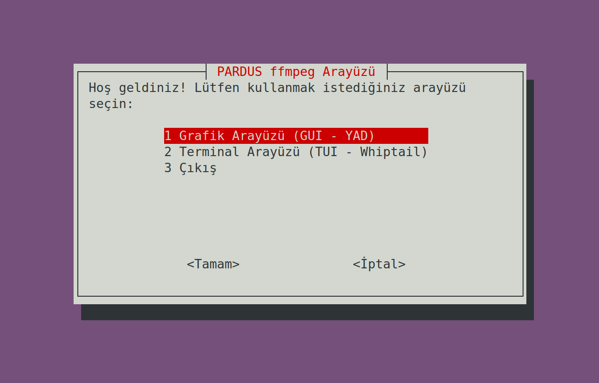
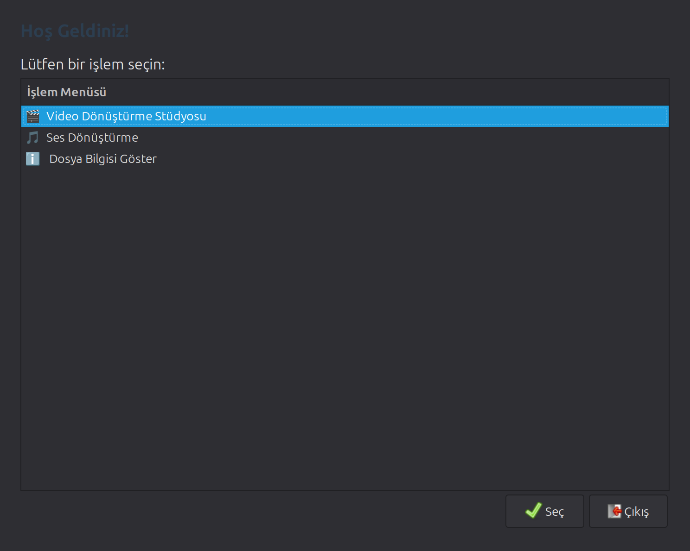
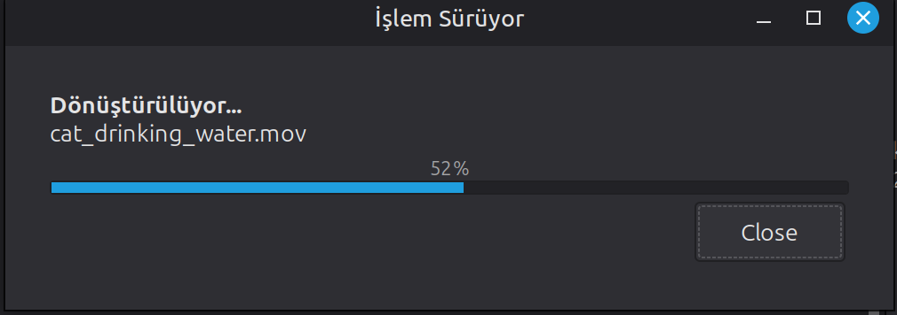
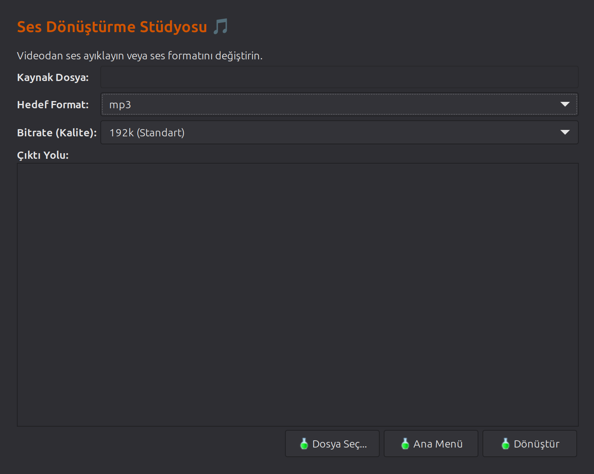
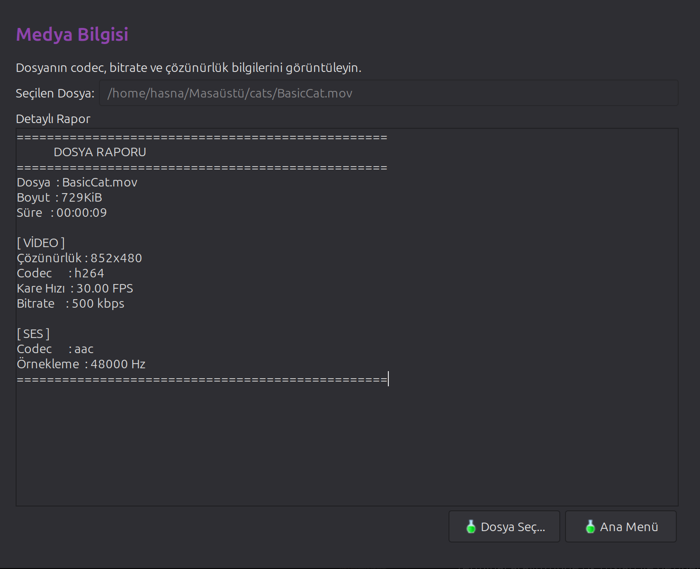
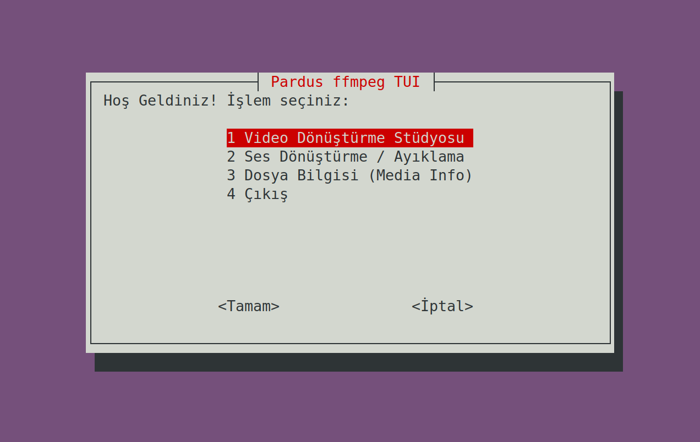
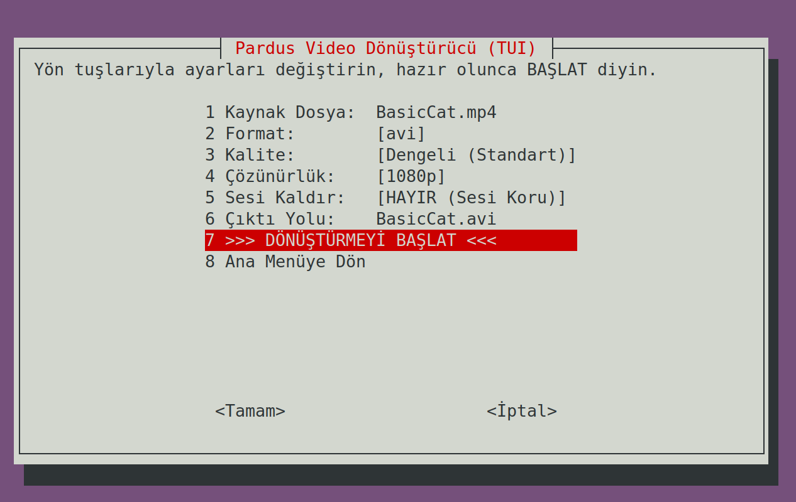
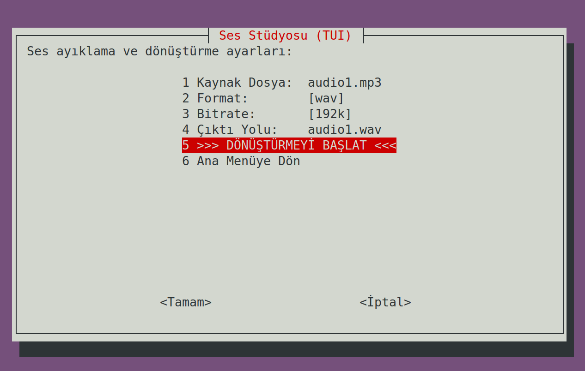
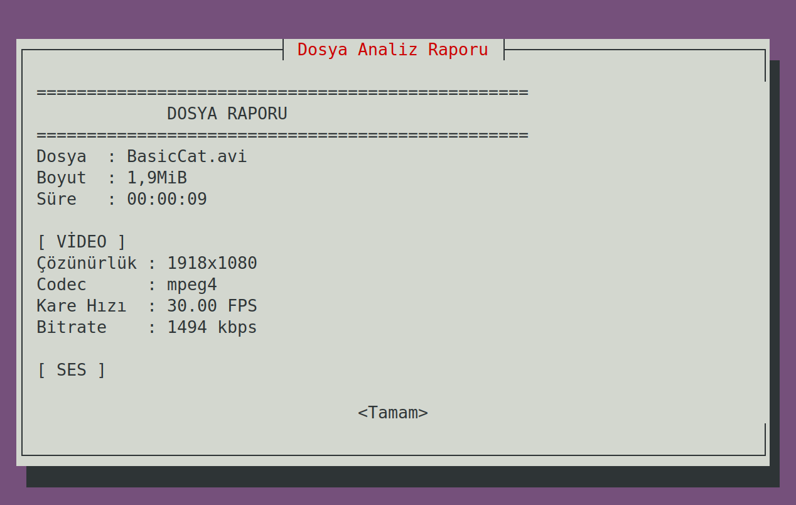

# Pardus ffmpeg Frontend - Video ve Ses Dönüştürme Arayüzü

## 📋 İçindekiler

- [Proje Hakkında](#proje-hakkında)
- [Özellikler](#özellikler)
- [Gerekli Paketler](#sistem-gereksinimleri)
- [Kurulum](#kurulum)
- [Kullanım Kılavuzu](#kullanım-kılavuzu)
  - [GUI (Grafik Arayüz)](#gui-grafik-arayüz)
  - [TUI (Terminal Arayüz)](#tui-terminal-arayüz)
- [Teknik Detaylar](#teknik-detaylar)
- [Video Demo](#video-demo)


## 🎯 Proje Hakkında

**Pardus ffmpeg Frontend**, `ffmpeg` aracı için geliştirilmiş, kullanıcı dostu bir arayüz uygulamasıdır. Bu proje, **Linux Scriptleri ve Araçları** dersi kapsamında, tamamen **Shell Script (Bash)** kullanılarak geliştirilmiştir.


## ✨ Özellikler

### 🎬 Video Dönüştürme Stüdyosu
- **Çoklu Format Desteği**: MP4, MKV, WebM, AVI, MOV, FLV
- **Kalite Seçenekleri**: Görsel Kayıpsız, Yüksek, Dengeli, Küçük Boyut, Arşivlik
- **Çözünürlük Ayarı**: Orijinal, 1080p, 720p, 480p
- **Ses Yönetimi**: Videodan sesi kaldırma seçeneği
- **Akıllı Format Dönüşümü**: WebM için Opus, AVI için MP3, diğerleri için AAC codec otomatiği
- **İlerleme Göstergesi**: Gerçek zamanlı dönüştürme ilerlemesi

### 🎵 Ses Dönüştürme Stüdyosu
- **Format Desteği**: MP3, M4A (AAC), FLAC (Kayıpsız), WAV (Ham), OGG
- **Kalite Seçenekleri**: 320k (Yüksek), 192k (Standart), 128k (Düşük)
- **Video'dan Ses Çıkarma**: Herhangi bir video dosyasından ses ayıklama
- **Otomatik İsimlendirme**: Format değişiminde akıllı dosya adı güncelleme

### ℹ️ Medya Bilgisi
- **Detaylı Raporlama**: Dosya boyutu, süre, çözünürlük
- **Video Bilgileri**: Codec, bitrate, kare hızı (FPS)
- **Ses Bilgileri**: Codec, örnekleme hızı
- **Kullanıcı Dostu Çıktı**: Temiz ve okunabilir metin raporu

### 🖥️ İki Arayüz Seçeneği

#### GUI (YAD Tabanlı)
- Modern ve şık tasarım
- Görsel geri bildirim ve ilerleme çubukları
- Drag & drop benzeri dosya seçici
- Renkli başarı/hata mesajları

#### TUI (Whiptail Tabanlı)
- Terminal üzerinde tam fonksiyonel arayüz
- Klavye navigasyonu ile hızlı kullanım
- Sunucu veya GUI olmayan sistemler için ideal
- Düşük kaynak tüketimi

---

## Gerekli Paketler
Proje aşağıdaki yazılımlara ihtiyaç duyar:

```bash
ffmpeg      # Video/ses işleme motoru
yad         # Grafik arayüz kütüphanesi
whiptail    # Terminal arayüz kütüphanesi
bc          # Matematiksel hesaplamalar
```


##  Kurulum

### Otomatik Kurulum (Önerilen)

1. **Depoyu klonlayın:**
```bash
git clone https://github.com/hasnasahinoglu/linux_ffmpeg_arayuz.git
cd linux_ffmpeg_arayuz
```

2. **Kurulum scriptini çalıştırın:**
```bash
chmod +x setup.sh
./setup.sh
```

Kurulum scripti otomatik olarak:
- Tüm bağımlılıkları kontrol eder
- Eksik paketleri yükler
- Dosya izinlerini düzenler

## 📖 Kullanım Kılavuzu

### Uygulamayı Başlatma

```bash
./main.sh
```

İlk açılışta karşınıza arayüz seçim ekranı gelecektir:



---

## 🎨 GUI (Grafik Arayüz)

### Ana Menü



Ana menüden 3 modül arasından seçim yapabilirsiniz:

1. **🎬 Video Dönüştürme Stüdyosu**
2. **🎵 Ses Dönüştürme**
3. **ℹ️ Dosya Bilgisi Göster**

### Video Dönüştürme İşlemi


**Adım Adım Kullanım:**

1. **"Dosya Seç..."** butonuna tıklayın
2. Dönüştürmek istediğiniz video dosyasını seçin
3. **Hedef Format** seçin (MP4, MKV, WebM, AVI, MOV, FLV)
4. **Kalite/Boyut** dengesini ayarlayın:
   - **En Yüksek**: CRF 18 (Görsel kayıpsız kalite)
   - **Yüksek**: CRF 20 (Çok iyi görüntü)
   - **Standart**: CRF 23 (Önerilen, dengeli)
   - **Küçük**: CRF 28 (WhatsApp paylaşımı için)
   - **En Küçük**: CRF 35 (Arşivlik)
5. İsterseniz **Çözünürlük** değiştirin (1080p, 720p, 480p)
6. Video'da ses istemiyorsanız **"Videodaki Sesi Kaldır"** seçeneğini işaretleyin
7. **Çıktı Yolu** otomatik oluşur (isterseniz düzenleyebilirsiniz)
8. **"Dönüştürmeyi Başlat"** butonuna tıklayın



İşlem sırasında gerçek zamanlı ilerleme gösterilir.

### Ses Dönüştürme İşlemi



**Kullanım:**

1. Video veya ses dosyası seçin
2. Hedef format seçin (MP3, M4A, FLAC, WAV, OGG)
3. Bitrate (kalite) seçin:
   - **320k**: Yüksek kalite (müzik arşivi)
   - **192k**: Standart (günlük kullanım)
   - **128k**: Düşük (konuşma kaydı, podcast)
4. "Dönüştür" butonuna tıklayın

**💡 İpucu**: Video dosyalarından sadece ses çıkarmak için bu modülü kullanın!

### Dosya Bilgisi Gösterimi



Herhangi bir medya dosyasının teknik detaylarını görüntüleyin:

- 📁 Dosya boyutu ve süresi
- 🎥 Video: Codec, çözünürlük, FPS, bitrate
- 🔊 Ses: Codec, örnekleme hızı

---

## 💻 TUI (Terminal Arayüz)

### Ana Menü



Terminal arayüzünde ok tuşları ile gezinebilir, Enter ile seçim yapabilirsiniz.

### Video Dönüştürme (TUI)



**Navigasyon:**

1. Yukarı/Aşağı ok tuşları ile menüde gezinin
2. Enter ile seçim yapın
3. Her ayarı teker teker yapılandırın:
   - Kaynak dosya yolunu yazın (Örn: `/home/kullanici/video.mp4`)
   - Format seçin
   - Kalite seçin
   - Çözünürlük seçin
   - Ses durumunu belirleyin
4. **">>> DÖNÜŞTÜRMEYİ BAŞLAT <<<"** seçeneğini seçin


Terminal tabanlı ilerleme çubuğu ile işlemi takip edin.

### Ses Dönüştürme (TUI)


Benzer şekilde:
- Dosya yolu girin
- Format ve kalite seçin
- Başlat

### Dosya Bilgisi (TUI)



Dosya yolunu girdikten sonra **"Raporu Görüntüle"** ile detaylı analiz alın.

---

## 🔧 Teknik Detaylar

### Proje Yapısı

```
pardus-ffmpeg-frontend/
├── main.sh              # Ana başlatıcı script
├── setup.sh             # Otomatik kurulum scripti
├── core.sh              # Çekirdek ffmpeg fonksiyonları
├── gui_module.sh        # YAD tabanlı GUI modülü
├── tui_module.sh        # Whiptail tabanlı TUI modülü
├── README.md            # Bu dosya
└── screenshots/         # Ekran görüntüleri klasörü

```

### Modüler Mimari

Proje, temiz ve sürdürülebilir kod için modüler yapıda tasarlanmıştır:

#### **core.sh** - İşlem Motoru
```bash
get_duration()                    # Video süresini öğrenme
convert_with_progress()           # Video dönüştürme + ilerleme
convert_audio_with_progress()     # Ses dönüştürme + ilerleme
get_video_metadata()              # Dosya bilgisi çıkarma
```

#### **gui_module.sh** - Grafik Arayüz
```bash
open_video_converter()   # Video dönüştürme penceresi
open_audio_converter()   # Ses dönüştürme penceresi
open_media_info_tool()   # Bilgi görüntüleme penceresi
run_gui()                # Ana GUI yönlendirici
```

#### **tui_module.sh** - Terminal Arayüz
```bash
open_tui_converter()        # TUI video dönüştürme
open_tui_audio_converter()  # TUI ses dönüştürme
open_tui_media_info()       # TUI bilgi gösterimi
run_tui()                   # Ana TUI yönlendirici
```

### Kullanılan ffmpeg Parametreleri

#### Video Dönüştürme
```bash
ffmpeg -i [input] \
  -crf [18-35]              # Kalite (düşük = yüksek kalite)
  -preset [slow-veryfast]   # Hız/sıkıştırma dengesi
  -vf scale=-2:[720/1080]   # Çözünürlük ölçekleme
  -c:a [aac/libopus/libmp3lame]  # Ses codec seçimi
  -movflags +faststart      # Web akışı için optimizasyon
  -pix_fmt yuv420p          # Uyumluluk için renk formatı
  [output]
```

#### Ses Dönüştürme
```bash
ffmpeg -i [input] \
  -vn                       # Video verisini yok say
  -c:a [codec]              # Ses codec (libmp3lame, aac, flac vb.)
  -b:a [bitrate]            # Ses kalitesi (128k, 192k, 320k)
  [output]
```


## 🎥 Video Demo

### YouTube Tanıtım Videosu

[](https://www.youtube.com/watch?v=VIDEO_ID_BURAYA)


---
